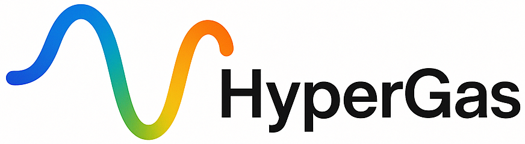

# HyperGas
The HyperGas package is a python library for retrieving trace gases enhancements from hyperspectral satellite data and writing it to different formats (NetCDF, PNG, and HTML). HyperGas also supports generating plume masks and calculating gas emission rates.

## Installation
Clone the repository first and choose perferred installation method below.

```bash
git clone git@gitlab.sron.nl:esg/tropomi-l4/hsi/HyperGas.git
```

### Step 1: Create Env

Install all packages from the `environment.yml` file:

```bash
conda env create -f environment.yml
```

If you use `mamba`, you can run:

```bash
mamba env create -f environment.yml
```

You need to activate the new environment before importing hypergas.

```bash
conda activate hypergas
```

If you want to activate it by default, you can add the above line to your `~/.bashrc`.

Finally, run `pip install -e .` inside the `HyperGas` folder.

### Step 2: Update Satpy

Because the Hyperspectral readers of Satpy have not been merged, you need to update the satpy package after the basic installation.

```bash
pip install git+https://github.com/zxdawn/satpy.git@hyper
```

### Step 3: Fix spectral

Edit `spectral/algorithms/algorithms.py` to prevent the `np.linalg.inv` singular matrix error (See this [issue](https://github.com/spectralpython/spectral/issues/159)).

```python
# You can find the <spectral_path> like this:
import spectral
print(spectral.__file__)
```

## Documentation

HyperGas’s documentation is built using Sphinx. All documentation is in the `doc/` directory of the project repository. For building the documentation, additional packages are needed. These can be installed with

```bash
    pip install -e ".[all]"
```

After editing the source files there, the documentation can be generated locally:

```bash
    cd doc
    make html
```

Your `build` directory should contain an `index.html` that you can open in your browser.
