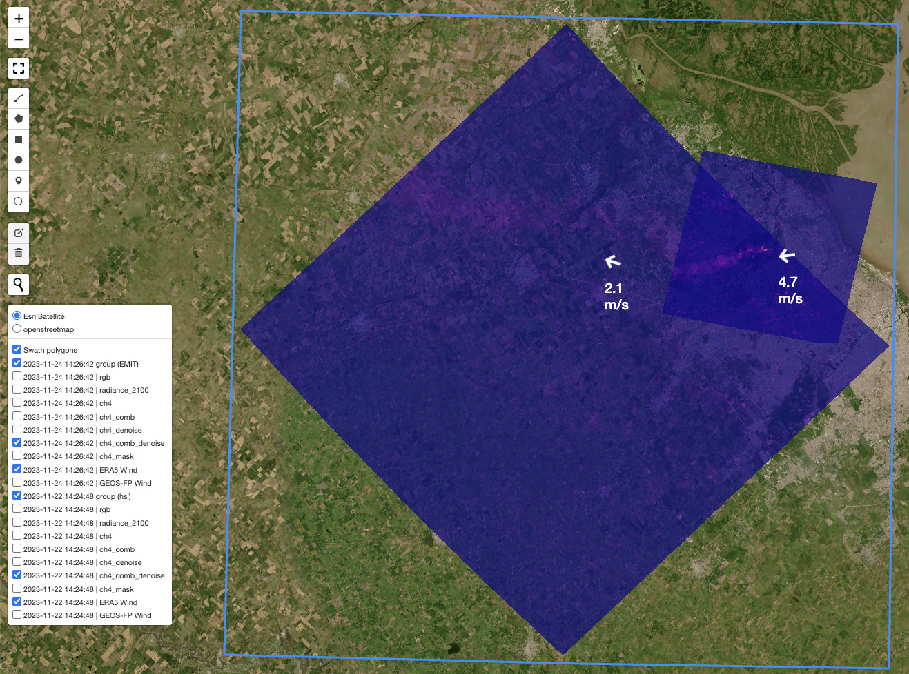
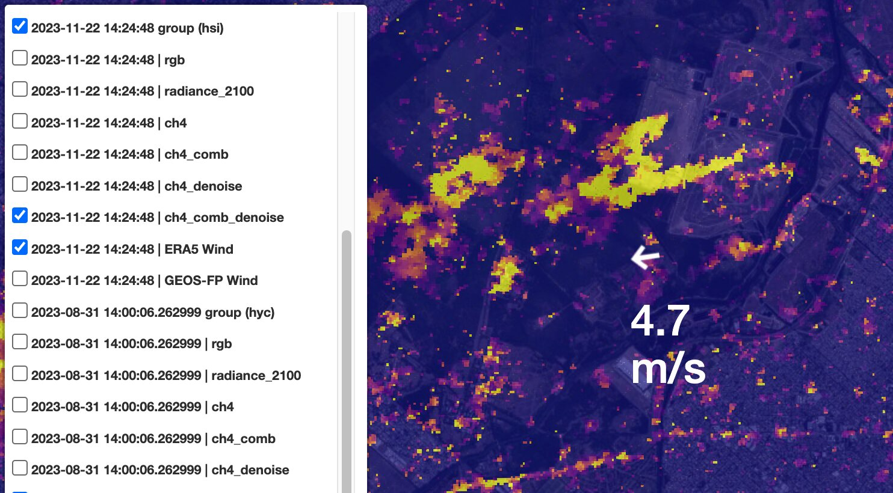

================
Batch Processing
================

HyperGas provides multiple Python scripts to process L1 data into L2 and L3/L4 products.
You can find them in the ``<HyperGas_dir>/scripts/`` directory.

.. list-table::
   :header-rows: 1

   * - Product Level
     - Description
     - Variables
     - Format
   * - L1
     - Radiance data
     - longitude, latitude, radiance
     - --
   * - L2
     - Orthorectified retrieval data
     - | longitude, latitude,
       | trace gas enhancement,
       | denoised trace gas enhancement,
       | RGB,
       | surface pressure, 10-m U, 10-m V
     - | NetCDF,
       | PNG,
       | HTML
   * - L3
     - Masked plume data
     - | longitude, latitude,
       | trace gas enhancement,
       | surface pressure, 10-m U, 10-m V,
       | emission rates info
     - | NetCDF
   * - L4
     - Emission estimation of plume
     - | plume_id, plume_latitude, plume_longitude,
       | datetime, country, state, city,
       | name, ipcc_sector, gas, plume_bounds,
       | instrument, platform, provider,
       | emission, emission_uncertainty,
       | emission_uncertainty_random, emission_uncertainty_wind,
       | emission_uncertainty_calibration,
       | emission_csf, emission_csf_uncertainty,
       | emission_csf_uncertainty_random,
       | emission_csf_uncertainty_wind,
       | emission_csf_uncertainty_calibration,
       | surface_pressure, wind_source, wind_speed, wind_direction,
       | ime, l_ime, ueff_ime, leff_ime,
       | ueff_csf, n_csf, l_csf,
       | alpha1, alpha2, alpha3, beta1, beta2,
       | wind_speed_all, wind_direction_all, wind_source_all,
       | azimuth_diff_max, dist_max,
       | land_only,land_mask_source
     - | CSV

.. note::

  The complete workflow for generating plume data is as follows:

    l2_process.py --> l2b_plot.py --> plume app --> l3_process.py --> l2_reprocess.py (optional) --> l3_reprocess.py (optional) --> l3_plot.py

  The l3_process.py generates both L3 (NetCDF) and L4 (CSV) products.

Here are the key points of each script:

L1 --> L2
=========

Step 1: l2b_process.py
----------------------

This script processes L1 data and exports retrieval products (NetCDF) to the same directory.
Users can use :class:`~xarray` to easily read and plot NetCDF files.

The script supports modifying following parameters:

- ``skip_exist (bool)``: Whether to skip already processed data.

- ``unortho_export (bool)``: Whether to export the unthrorectified retrieval field.

- ``species (str, list)``: The gas species to be retrieved.

    - 'all': retrieve all supported gases
    - A single gas name, e.g. 'ch4'
    - A list of gas names, e.g. ['ch4', 'co2']

- ``data_dir (str)``: The root dir of L1 data.

    The script recursively processes all data within the specified root directory and saves NetCDF files in each subdirectory.
    For example, if L1 data is organized as ``<data>/<facility_1>/`` and ``<data>/<facility_2>/``,
    setting ``data_dir = <data>`` will process all L1 data under both ``facility_1`` and ``<facility_2>``,
    exporting the corresponding L2 data to each folder separately.

If ``species = 'ch4'``, the output L2 file will contain the following variables:

.. list-table::
    :header-rows: 1

    * - Variable name
      - Description
    * - y
      - y coordinate of projection
    * - x
      - x coordinate of projection
    * - latitude
      - 2D latitude
    * - longitude
      - 2D longitude
    * - ch4
      - | 2D ch4 enhancement field
        | (retrieved by the strong absorption window)
    * - ch4_comb
      - | 2D ch4 enhancement field
        | (retrieved by a wider absorption window to decrease background noise)
    * - ch4_denoise
      - denoised 2D ch4 field
    * - ch4_comb_denoise
      - | denoised 2D ch4_comb field
        | (this is the default variable to create plume masks later)
    * - ch4_mask
      - a priori ch4 masks
    * - radiance_2100
      - | 2D radiance data closest to 2100 nm 
        | (this is useful to check albedo effects)
    * - rgb
      - 2D RGB
    * - segmentation
      - 2D pixel classification (land or ocean)
    * - sp
      - 2D surface pressure
    * - u10
      - 2D 10 m U wind speed
    * - v10
      - 2D 10 m V wind speed

Step 2: l2b_plot.py
-------------------

This script reads L2 data and plots images as PNG files.
These images are then combined into chunked HTML files using Folium.
Users can view multiple variables across different days by toggling layers in the HTML interface.

The script supports modifying following parameters:

- ``skip_exist (bool)``: Whether to skip already plotted data.

- ``root_dir (str)``: The root_dir of the L2 data.

- ``plot_markers (bool)``: Whether to plot pre-saved markers (see :doc:`config`) on the map.

- ``chunk (int)``: Number of files per HTML chunk. Reduce this value if you encounter memory errors.

- ``pad (float), lat_zoom (float), lon_zoom (float)``: Controls the plotting region. If set to ``None``, the whole scene is plotted.

Example of an HTML output:

The layers on the left have two main components: *group* and *variables*.
The *group* level controls all sub-layers: RGB, radiance, and gas product map.
Wind arrows are positioned at the scene center and can be repositioned by clicking and dragging:

.. note::

  The colorbar limit for the denoised field is set automatically from the ``mean_value`` to the ``maximum value``,
  For the original field, it is hardcoded in ``<HyperGas_dir>/hypergas/folium_map.py`` to allow comparison across different days.

L2 --> L3/L4
============

The streamlit app is designed to interactively generate L3 and L4 products, including plume masks and emission rates.
For more information, refer to :doc:`plume_app`.

Reprocessing (optional)
=======================

HyperGas supports reprocessing L2 and L3 data by excluding L3 plume pixels from the matched filter analysis.

Reprocessing L2 data
--------------------

Incorporating plumes into the matched filter statistics might break the sparsity assumption,
potentially causing lower enhancements, particularly for highly-emitting (> 10 t/h) plumes.
For example, a Norte III landfill emission was initially estimated at 13 t/h but was corrected to 20.7 t/h after reprocessing.
Therefore, running ``l2_reprocess.py`` is essential to refine L2 results using L3 plume masks.

Supported parameters:

- ``root_dir (str)``: Root directory of L2 data.

- ``species (str)``: Gas species to reprocess.

- ``rad_dist (str)``: Radiation distribution type — 'auto', 'lognormal' or 'normal'.
  - 'auto': if the methane emission rate is higher than 10 t/h, the lognormal matched filter will be applied.

- ``land_mask_source (str)``: Source for land classification. Options: "OSM", "GSHHS" or "Natural Earth".

Reprocessing L3 data
--------------------

To recalculate emission rates using the updated L2 data, users can either rerun the Plume App or execute the ``l3_reprocess.py`` script.
This script reads both L2 and existing L3 NetCDF files and generates updated L3 products according to the settings specified in the L3 CSV file.

Supported parameters:

- ``root_dir (str)``: Root directory of L3 data.

- ``reprocess_nc (boolean)``: Whether to regenerate L3 NetCDF files.
  - If ``False``, the script will calculate emission rates using the existing NetCDF data based on the CSV settings.

- ``wind_data (str)``: Source of wind data. Options: 'auto', 'ERA5', or 'GEOS-FP'.
  - ``'auto'``: reads wind source from the CSV file.

- ``wspd_manual (float or None)``: Manually override wind speed. If ``None``, the reanalysis wind speed from the CSV file is used.

.. note::

   Please verify the plume mask after reprocessing. Due to changes in the retrieval data, the mask may differ even if the CSV settings remain the same.
