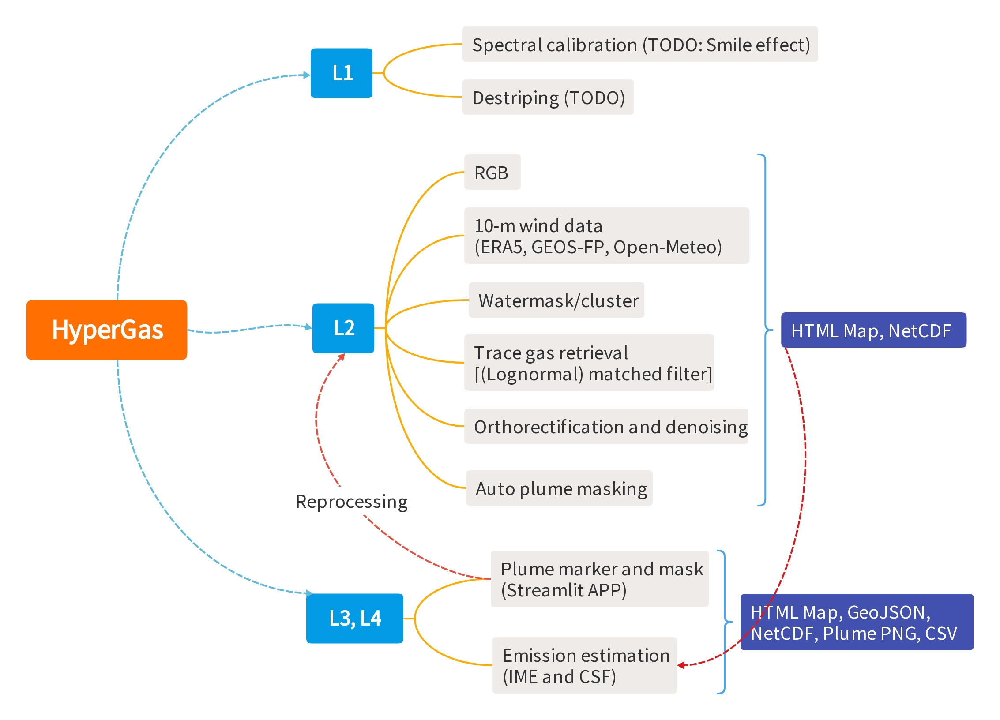

========
Overview
========

HyperGas is designed to facilitate the retrieval of trace gases for HSI instruments with ease.
All necessary details for performing these operations are internally configured in HyperGas.
This means that users do not need to concern themselves with the specific implementation,
but rather focus on their desired outcome.
Most of the features offered by HyperGas can be customized using keyword arguments.
The following sections describe the various components and concepts of HyperGas.
Additionally, the :doc:`quickstart` guide presents straightforward example of HyperGas.

Reading
=======

HyperGas uses `Satpy <https://satpy.readthedocs.io/>`_ to directly read HSI L1 data,
which offers support for a wide range of satellite datasets.
For detailed information, please refer to Satpy's documentation.
Since HSI file formats vary across different instruments,
we have integrated multiple HSI readers into Satpy, ensuring a standardized data loading interface.
This makes it easy to add new HSI data for HyperGas.

Retrieval
=========

HyperGas emploies a linearized matched filter to retrieve the trace gas enhancements.
This technique has been successfully applied to both satellite and aircraft observations.
HyperGas applies the matched filter to each cluster separately to account for the different background signals in land and water pixels.
See :doc:`cluster` for more information about watermask.

Besides the linear matched filter, HyperGas also supports lognormal matched filter and Cluster-tuned matched filter.
See :doc:`retrieval` for more information.

Orthorectification
==================

Hyperspectral Level 1 data is provided in sensor geometry,
which means the image data has only image coordinates rather than map coordinates.
HyperGas addresses this limitation by supporting both automatic and manual orthorectification methods.

For automatic orthorectification of EnMAP and EMIT data,
HyperGas reads available Rational Polynomial Coefficients (RPCs) or geometric lookup tables (GLTs) from L1 data
and uses the `rasterio <https://rasterio.readthedocs.io/en/stable/topics/reproject.html#reprojecting-with-other-georeferencing-metadata>`_
library to apply orthorectification transformations.

Since PRISMA L1 data does not include orthorectification information,
users need to provide Ground Control Points (GCPs) for manual orthorectification.
`QGIS <https://docs.qgis.org/3.40/en/docs/user_manual/working_with_raster/georeferencer.html>`_ provides a comprehensive guide for this process in its documentation.
If GCPs are unavailable, users can still proceed with plume detection and quantification workflows;
however, they should be aware that geographic positioning may contain spatial offsets of up to 200 meters without proper orthorectification.

Denoising
=========

To mitigate the noisy background, we initially perform the same retrieval over a wider spectral range (e.g., 1300 :math:`\sim` 2500 nm for methane and carbon dioxide).
Then, we apply a Chambolle total variance denoising
`(TV) filter <https://scikit-image.org/docs/stable/api/skimage.restoration.html#skimage.restoration.denoise_tv_chambolle>`_
with the `J-Invariance calibration <https://scikit-image.org/docs/stable/auto_examples/filters/plot_j_invariant_tutorial.html>`_
to obtain a smoothed enhancement field.
The TV filter aims to minimize the cost function between the original and smoothed images.

.. Writing
.. =======

.. HyperGas enables users to save data in various formats, including PNG, HTML, and data file formats such as NetCDF.
.. Please refer to the documentation on writing (see :doc:`writing`) for detailed information.

.. Emission Rates
.. ==============

