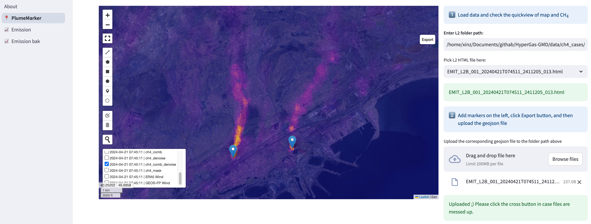
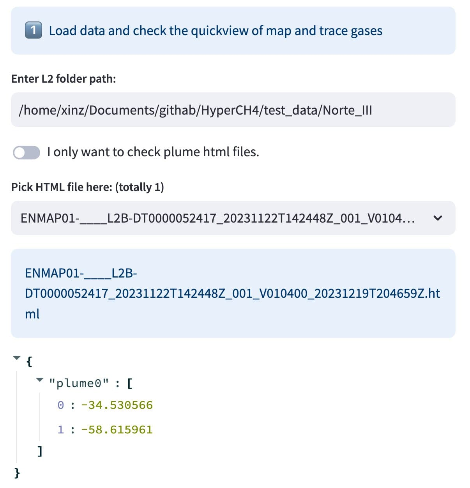
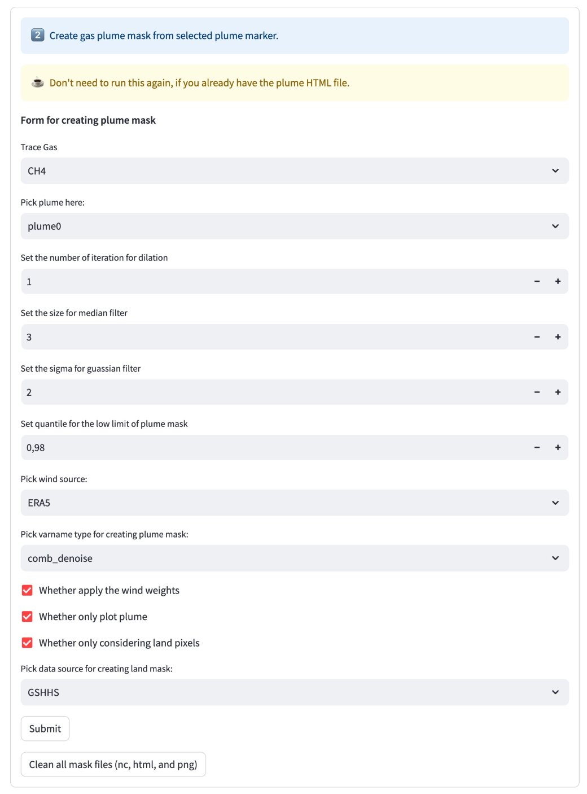
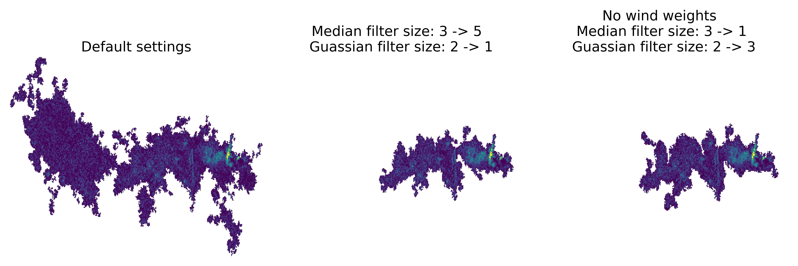
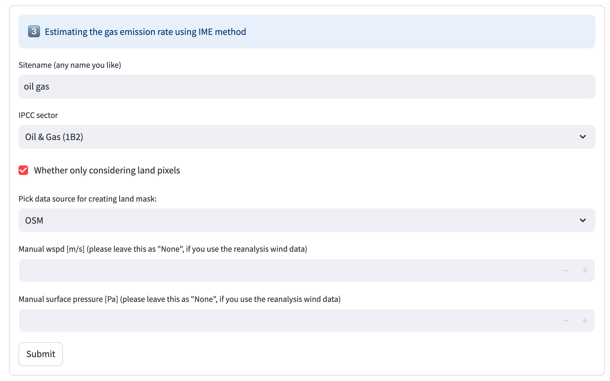
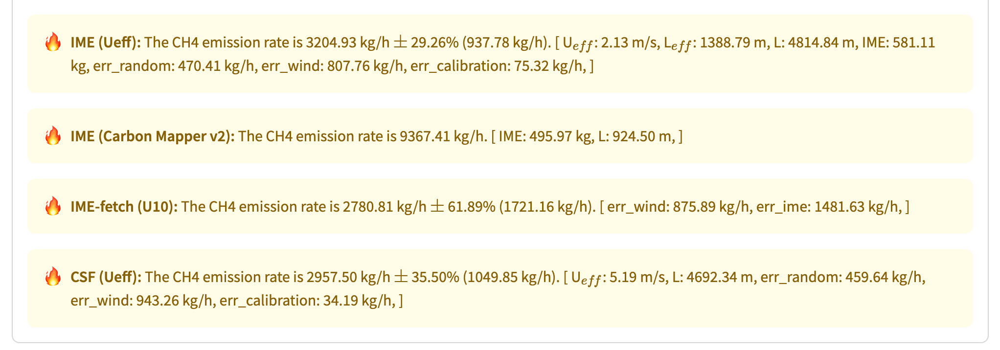

=========
Plume APP
=========

The Plume APP, constructed using `Streamlit <https://docs.streamlit.io/>`_, features two primary functions:
1) adding markers for plume sources and 2) calculating emission rates using plume masks.

Deploy
======

The Plume APP is deployable on both local and remote machines.

Local
-----

.. code-block:: bash

    cd HyperGas
    streamlit run About.py

The browser will automatically open the website by default;
if not, you can manually open it by copying the Local URL displayed in the terminal.

Remote
------

.. code-block:: bash

    cd HyperGas
    streamlit run About.py --server.headless true --server.port 8501

If users have a remote machine or server, they can run the app on the server as above and then establish a connection to it using SSH:

.. code-block:: bash

    ssh -N -L localhost:8501:localhost:8501 <username>@<server_ip>

.. note::

    If port 8501 is already in use, consider changing the default 8501 port used by Streamlit to ensure seamless operation.
    
    Running the application in the background allows for easy access at any time.
    Utilizing `tmux <https://github.com/tmux/tmux>`_, a tool that facilitates running multiple panels and monitoring outputs, enhances productivity and efficiency.

1) Plume Marker
===============

The "PlumeMarker" page features a primary preview window and two panels.
Upon entering the L2 folder path, the preview window will display the content identical to the HTML file generated by ``l2b_plot.py``.

Then, users can employ the "Draw a marker" tool to mark multiple sources on the map.
After defining all hotspots, users should click the "Export" button located in the top right corner to generate a geojson file.
Finally, users can click the "Browse files" button to either move the file locally or upload it remotely to the same directory as the L2 data.

.. note::

    The geojson files are essential for the upcoming "Emission" phase. 

    Furthermore, users have the option to load the geojson file alongside the L2 NetCDF file to verify the locations at a later time.

The green notification bar signals the successful upload of the geojson file.
It is advisable to click the cross button to securely clear the cache. 
In the event that users input the same path in the future, a warning will be displayed:

.. warning::

    You have already generated markers before. Please take care if you wanna recreate markers.

2) Emission
===========

The "Emission" page features a primary preview window and three panels: "Load data," "Create plume mask", and "Estimate emission rates."

Load data
---------

Once the folder path is verified, the preview window will display the L2 or plume HTML (if available).
When the "I only want to check plume HTML files" toggle is enabled, only existing plume HTML files will be visible.

Create plume mask
-----------------

Initially, this tool identifies plume pixels using a percentile mask over land and then smooths them using median and Gaussian filters.
The function supports the modification of the following parameters:

- ``trace gas``: the gas field to be identified.

- ``pick plume``: the specific source location. If there are multiple plumes, such as ``plume0`` and ``plume1``, users need to run this step seperately to generate individual plume NetCDF and csv files.

- ``number of iteration (int)``: the number of iterations for :class:`scipy.ndimage.binary_dilation`. Default: 1.

- ``size of median filter (int)``: the size of :class:`scipy.ndimage.median_filter`. A larger median filter size typically results in a more condensed mask. Default: 3.

- ``sigma for guassian filter (int)``: the size of :class:`scipy.ndimage.gaussian_filter`. A larger Gaussian filter size generally leads to a larger plume mask. Default: 2.

- ``quantile (0 < float < 1)``: the quantile value used to establish the initial mask. Default: 0.98.

- ``wind source``: wind source used for wind weights (if turned on) and emission estimates. Default: True.

- ``varname``: the variable name for creating plume mask. Default: denoised gas field with a broder wavelength window. Default: comb_denoise.

- ``whether to apply the wind weights``: whether to assign higher weights to pixels downwind. Default: True.

- ``Whether only plot plume``: whether only to plot the plume without other fields. Default: True.

- ``Whether only considering land pixels``: whether only to consider pixels over land. Default: True.

- ``"data source for creating land mask``: the source of land classification. Default: GSHHS. If "Whether only considering land pixels" is turned on, this should be the same as the setting in ``l2_process.py``.

Once the settings have been successfully submitted, users can press the ``R`` shortcut to refresh the page for loading and selecting the new plume HTML file.
Duplicating the tab makes it easier to compare the plume mask with the full field image on the PlumeMarker page.
If the plume mask appears incorrect, users can toggle "I still want to create a new plume mask" to adjust settings and resubmit until satisfied.

Here is an example of landfill methane plume masks generated using various settings.
Because the default settings capture many pixels outside the plume, adjustments are necessary.
Typically, there are usually two options: 1) increasing the median filter size 2) deactivating wind weights and reducing median filter size.

.. note::
    For certain oil and gas facilities, the plume is typically continuous and extensive.
    Deactivating wind weights, reducing the median filter size, or increasing the Gaussian filter size is recommended for better results.

.. note::
    When considering the data source for generating a land mask, two options are available: "GSHHS" and "Natural Earth".
    By default, we use GSHHS due to its superior resolution.
    However, users should be careful of specific scenarios.
    For instance, the Caspian Sea near Kazakhstan is classified as land in GSHHS but as ocean in Natural Earth.
    For more information, please refer to the `land mask notebook <https://github.com/zxdawn/HyperGas/blob/main/notebooks/land_mask.ipynb>`_.

Estimate emission rates
-----------------------

The emission estimation tool utilizes the Integrated Methane Enhancement (IME) method.
It supports the adjustment of various parameters:

- | ``alpha (floats)``: :math:`U_{eff}` = :math:`\alpha_1` * np.log(wspd) + :math:`\alpha_2` + :math:`\alpha_3` * wspd. By default, :math:`\alpha_1` = 0 and :math:`\alpha_3` = 0.34.
  | Following `Maasakkers et al. 2022 <https://doi.org/10.1126/sciadv.abn9683>`_, we suggest the following settings:

    - Point source (oil & gas, coal mining): Set :math:`\alpha_2` to 0.42.
    - Area source (landfill): Set :math:`\alpha_2` to 0.66.

- ``sitename (str)``: specify the preferred facility name. Valuable sources include `Carbon Mapper <https://carbonmapper.org/>`_, `Climate TRACE <https://climatetrace.org/>`_, and `Global Energy Monitor <https://globalenergymonitor.org/>`_.

- ``IPCC sector (str)``: the sector name according to the IPCC definition.

- ``platform (str)``: the platform name is automatically determined based on the filename.

- ``whether TROPOMI captures the source``: indicate whether TROPOMI detects the source.

- ``whether ClimateTrace dataset contains the source``: specify if the Climate TRACE dataset includes the source.

- ``whether only considering land pixels``: whether only to consider pixels over land.

- ``manual wspd (float)``: manually override the wind speed (m/s).

Upon submission, the concise output displaying emission rates and uncertainty will be presented as shown below:

.. note::
    It is advisable to use the ``IME (Ueff)`` method at this stage, as the ``IME-fetch (U10)`` method is awaiting comparison with the `official method <https://doi.org/10.1038/s41586-019-1720-3>`_.
