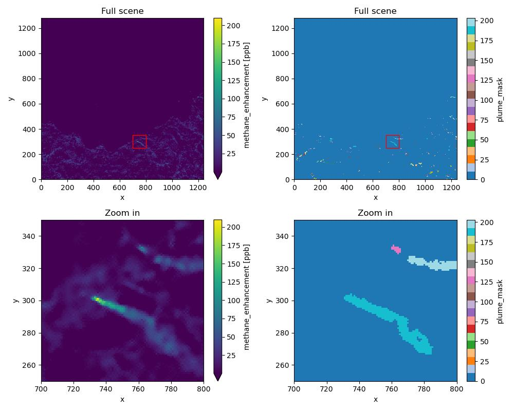

=============
Plume Masking
=============

Because the background field can be noisy, we suggest denoising the data first following :doc:`denoising`.
After generating the denoised gas enhancement, HyperGas uses the `tobac <https://github.com/tobac-project/tobac>`_
package to detect features of high values and create the mask by watershedding.
Please refer to `tobac's documentation <https://tobac.readthedocs.io/en/latest/>`_ for details.

.. code-block:: python

   >>> from hypergas.a_priori_mask import Mask

   >>> # assign the DataArray to Scene
   >>> hyp.scene['ch4_denoise'] = ch4_denoise

   >>> # run detection and masking
   >>> thresholds, features, da_plume_mask = Mask(hyp_emit.scene, varname='ch4_denoise').get_feature_mask()

   >>> # plot the denoised data and mask
   >>> fig, axs = plt.subplots(nrows=2, ncols=2, figsize=(10, 8))
   >>> 
   >>> ch4_emit_denoise.plot(ax=axs[0, 0], vmin=ch4_emit_denoise.mean())
   >>> da_plume_mask.plot(ax=axs[0, 1], cmap='tab20')
   >>> 
   >>> ch4_emit_denoise.plot(ax=axs[1, 0], vmin=ch4_emit_denoise.mean())
   >>> da_plume_mask.plot(ax=axs[1, 1], cmap='tab20')
   >>> 
   >>> for ax in axs[1, :]:
   >>>     ax.set_xlim(700, 800)
   >>>     ax.set_ylim(250, 350)
   >>>     ax.set_title('Zoom in')

